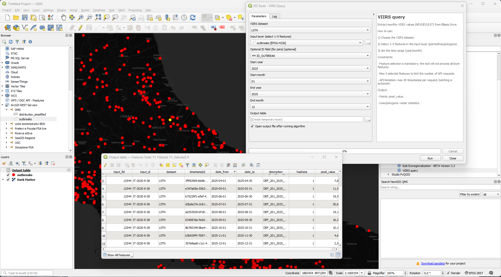

# VIIRS Query – QGIS Processing Tool


QGIS Processing tool for querying monthly **VIIRS raster datasets** hosted on **Ellipsis Drive** via REST API.

The tool extracts raster values or statistics for selected vector features and returns a tabular output suitable for further analysis or join operations.

---

## 📌 Overview

</img>

`VIIRS Query` is a QGIS Processing script that:

- Retrieves available monthly timestamps from Ellipsis Drive
- Filters timestamps based on user-selected date range
- Converts selected vector features to GeoJSON (EPSG:4326)
- Queries the `/raster/timestamp/analyse` endpoint
- Handles API batching (max 50 timestamps per request)
- Outputs a structured table (no geometry)

The tool is designed for **targeted analysis** on a limited number of features.

---

## 📊 Available Datasets

| Code | Description |
|------|------------|
| LSTD | Land Surface Temperature – Day |
| LSTN | Land Surface Temperature – Night |
| NDVI | Normalized Difference Vegetation Index |
| EVI  | Enhanced Vegetation Index |

### Dataset Characteristics

- Temporal coverage: **2018 – present**
- Temporal resolution: **monthly**
- Spatial resolution: **0.05° (~5.5 km)**

---

## ⚙️ Processing Workflow

1. User selects:
   - Dataset
   - Input vector layer
   - Date range (year/month start & end)
   - Optional ID field (for join)

2. Tool execution:

   ```text
   GET /v3/path/{datasetId}
   → retrieve timestamps
   → filter by date range

   For each selected feature:
       Split timestamps in batches of 50
       GET /raster/timestamp/analyse
       → returnType=statistics
   ```

3. Output table is generated.

---

## 🔎 Constraints

- **Mandatory feature selection**
- Maximum **5 selected features**
- Maximum **50 timestamps per API request**
- Automatic batching for longer time ranges
- CRS automatically transformed to **EPSG:4326**

---

## 📄 Output Structure

### Common Fields

| Field | Description |
|--------|------------|
| input_fid | Internal QGIS feature ID |
| input_id | Optional user-selected ID field |
| dataset | Dataset name |
| timestampId | Monthly timestamp ID |
| date_from | Start date (YYYY-MM-DD) |
| date_to | End date (YYYY-MM-DD) |
| description | Timestamp description |
| hasData | 1 = valid data, 0 = no data |

---

### For Point Layers

| Field | Description |
|--------|------------|
| pixel_value | Raster value (rounded to 2 decimals) |

For point geometries, the tool extracts:

- `statistics.histogram[0].bin`  
- Fallback: `statistics.mean`

---

### For Line/Polygon Layers

| Field | Description |
|--------|------------|
| min | Minimum |
| max | Maximum |
| mean | Mean |
| median | Median |
| deviation | Standard deviation |
| sum | Sum |

All numeric values are rounded to **2 decimal places**.

---

## 🔗 Join Strategy

To reattach results to the original layer:

- Select an ID field before running the tool
- Use `input_id` for tabular joins

If no ID field is selected, `input_fid` remains available.

---

## 🧠 API Technical Notes

### Timestamp retrieval

```http
GET https://api.ellipsis-drive.com/v3/path/{datasetId}
```

Returns raster metadata including timestamp definitions.

### Statistics request

```http
GET /v3/path/{datasetId}/raster/timestamp/analyse
```

Parameters:

- `timestampIds` → JSON list
- `geometry` → GeoJSON geometry
- `returnType=statistics`

### Batching Logic

```python
MAX_TIMESTAMPS_PER_REQUEST = 50
```

If more than 50 timestamps are selected:

```python
timestamps → split into chunks of 50
multiple analyse calls executed
results aggregated
```

---

## 🏗 Architecture

- QGIS Processing Script
- Python 3.x
- `requests` for REST calls
- No authentication required (public datasets)
- Output: memory layer (table)

---

## 🚀 Installation

1. Copy the script into:

   ```
   %APPDATA%/QGIS/QGIS3/profiles/default/processing/scripts/
   ```

2. Restart QGIS
3. Open Processing Toolbox → **IZS Tools**
4. Run **VIIRS query**

---

## 🛠 Requirements

- QGIS ≥ 3.28
- Python 3.x (bundled with QGIS)
- Internet access

---

## 📈 Performance Considerations

- Designed for small feature selections (≤5)
- Not optimized for large-scale batch analysis
- Each feature triggers one or more REST calls
- Long temporal ranges increase execution time

---

## 📜 License

MIT (see `LICENSE`).

---

## 👥 Authors

Developed within GIS activities – IZSAM.
